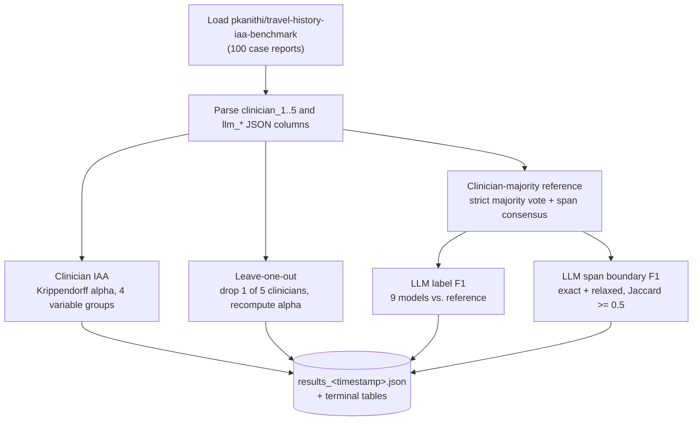
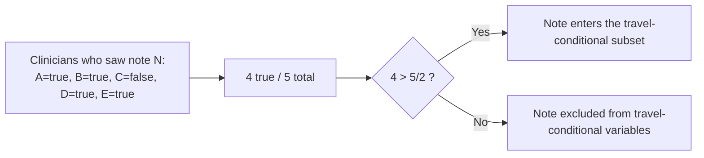

# Travel History IAA Analysis

Inter-annotator agreement (IAA) and LLM evaluation for structured extraction of
international travel history from clinical case reports. This repository
contains the analysis code for the study; it does not contain the dataset
itself, which is loaded at runtime from the Hub.

Analysis code: https://github.com/praveenkanithi/travel-history-iaa-analysis

## Overview

Five clinicians and nine LLMs independently annotated the same 100
PubMed case reports for a shared schema: whether the patient had international
travel, seven travel-exposure categories, symptom-onset timing, and five
named-entity spans (destination, travel duration, etc.). This repository
answers two questions from that data:

1. **How consistently did the clinicians agree with each other?**
   Krippendorff's alpha per variable, plus a leave-one-out (LOO) analysis that
   drops each clinician in turn to see how much overall agreement depends on
   any single rater.
2. **How well do LLMs match a clinician-majority reference?**
   Label F1 for every variable, and span-boundary F1 (exact and relaxed) for
   the five entity types.



## Data

Source: [`pkanithi/travel-history-iaa-benchmark`](https://huggingface.co/datasets/pkanithi/travel-history-iaa-benchmark)
(Hugging Face Hub, private). One row per case report, with:

- `case_report` -- the full note text
- `clinician_1` ... `clinician_5` -- one structured annotation per clinician (JSON-encoded), or `null` if that clinician did not see the case
- `llm_*` -- one structured annotation per LLM (JSON-encoded), same schema

Each structured annotation has `has_international_travel` (bool),
`symptom_onset_relative_to_return` (categorical), seven `exposure_*`
categorical fields, and `entities` (a list of `{label, text, start, end}`
character-offset spans). See the dataset's own README for the full field
reference and provenance.

Access requires a Hugging Face account with permission on the dataset and
either `huggingface-cli login` or an `HF_TOKEN` environment variable.

### Majority-travel gate

Categorical exposure fields and four of the five entity types are only
meaningful once travel has happened, so those variables are scored on the
subset of notes where a strict majority of clinicians agreed travel occurred:



`time_since_first_symptom_at_presentation` is the exception: symptom onset can
be reported regardless of travel, so it is scored on all notes.

## Repository structure

```
.
├── run_analysis.py          # entry point: prints tables, writes results/*.json
├── src/
│   ├── data.py               # loads + parses the HF dataset
│   ├── metrics.py            # alpha, precision/recall/F1, span matching
│   ├── clinician_iaa.py      # 4 IAA variable groups + leave-one-out
│   └── llm_eval.py           # majority reference + LLM label/span F1
├── tests/                    # pytest; test_data.py needs network + HF access
├── prompts/                  # LLM annotation prompts used in the study
├── requirements.txt
└── results/                  # gitignored; populated by run_analysis.py
```

## Usage

```bash
pip install -r requirements.txt
huggingface-cli login          # or: export HF_TOKEN=...

python run_analysis.py         # prints all tables, writes results/results_<timestamp>.json
pytest                         # unit tests + one live-data integration test
```

### Example output

```
== Table 1: Travel presence (Krippendorff alpha) ==
variable                    alpha    observed_agreement    n_notes
------------------------  -------  --------------------  ---------
has_international_travel   0.9479                0.9783        100

== Table 5: Leave-one-out alpha (each column = alpha with that clinician removed) ==
variable                    alpha (all 5)    clinician_1    clinician_2    clinician_3    clinician_4    clinician_5
-------------------------  ---------------  -------------  -------------  -------------  -------------  -------------
has_international_travel            0.9479         0.9348         0.9462         0.9835         0.9301         0.9465

== Table 6: LLM label F1 vs. clinician-majority reference ==
variable                    llm_gemma_4_31b_it    llm_gpt_5_4    ...
-------------------------  --------------------  -------------  ----
has_international_travel                 0.9927         0.9927  ...
```

`results/results_<timestamp>.json` contains the same numbers in full, e.g.:

```json
{
  "generated_at": "2026-08-11T12:13:39.173378+00:00",
  "dataset": "pkanithi/travel-history-iaa-benchmark",
  "n_notes": 100,
  "n_travel_present_notes": 68,
  "llm_evaluation": {
    "llm_gpt_5_4": {
      "label_f1": {
        "has_international_travel": {"precision": 0.9855, "recall": 1.0, "f1": 0.9927, "n": 86}
      }
    }
  }
}
```

## Prompts

The system/user prompts used to generate the LLM annotations -- the main
study prompt, four prompt-wording variants, and two reduced-comprehensiveness
variants -- are included verbatim under [`prompts/`](prompts/) for reviewer
visibility. See [`prompts/README.md`](prompts/README.md) for what each file
is.

## Notes on scope

- No LLM ensemble/consortium annotator is built; each of the 9 models is
  scored individually against the clinician-majority reference.
- This repository does not produce plots -- all output is tabular (terminal
  + JSON).
